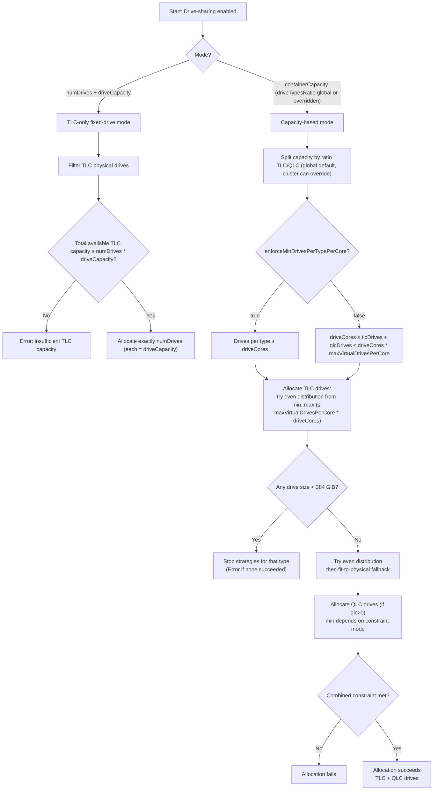

# Drive Sharing Allocation Logic (v1.10.0)

This note summarizes the drive‑sharing allocation logic based on:
- `doc/operator/operations/drive-sharing.md`
- `internal/controllers/allocator/drive_allocation_strategies_test.go`

## Modes

### 1) Fixed capacity per virtual drive (TLC‑only)
- Uses `numDrives` + `driveCapacity`.
- `driveTypesRatio` is ignored.
- Allocates exactly `numDrives` TLC virtual drives of size `driveCapacity`.
- Requires enough total available TLC capacity to fit `numDrives * driveCapacity`.

### 2) Capacity per container + drive types ratio
- Uses `containerCapacity` + `driveTypesRatio` (always set globally; can be overridden per cluster).
- Splits capacity by ratio into TLC and QLC pools.
- For each type, allocates a number of virtual drives via strategy search.
- Hard minimum per‑drive size: `MinChunkSizeGiB = 384`.
- Maximum drives per container: `driveCores * maxVirtualDrivesPerCore`.

## Strategy Search Order (per type)
1. Even distribution strategies (minDrives, minDrives+1, … maxDrives)
2. Fit‑to‑physical fallback (only if even distribution exhausted and constraints allow)
3. Stop early when any candidate size would be `< 384 GiB`

## Config Options That Affect Allocation
- `spec.dynamicTemplate.numDrives` (fixed TLC‑only mode)
- `spec.dynamicTemplate.driveCapacity` (fixed TLC‑only mode)
- `spec.dynamicTemplate.containerCapacity` (ratio mode)
- `spec.dynamicTemplate.driveTypesRatio` (ratio mode, overrides global)
- `spec.dynamicTemplate.driveCores` (min drives + max drives)
- `driveSharing.enforceMinDrivesPerTypePerCore` (Helm)
- `driveSharing.maxVirtualDrivesPerCore` (Helm)
- `MinChunkSizeGiB = 384`
- `driveSharing.enableDynamicDriveScalingForSharedDrives` (default `false`; governs reallocation on spec change / clusterCapacity grow)

## Flowchart

## Examples

### Example 1: MinChunkSizeGiB blocks allocation
- `driveCores=3`, `containerCapacity=1000`
- Even 3 drives => 333 GiB each (< 384)
- Result: no strategies; allocation fails

### Example 2: Per‑type vs combined constraint
- `driveCores=5`, `containerCapacity=5000`, ratio `tlc:4, qlc:1`
- TLC=4000, QLC=1000
- Per‑type (`enforceMinDrivesPerTypePerCore=true`) fails (QLC < 1920)
- Combined (`false`) succeeds

### Example 3: Combined constraint iteration
- `driveCores=3`, `containerCapacity=1500`, ratio `tlc:2, qlc:1`
- TLC=1000, QLC=500
- Try TLC min=1 => QLC min=2 => 250 GiB (<384) fails
- Retry TLC min=2 => QLC min=1 succeeds (2 TLC, 1 QLC)

### Example 4: Fit‑to‑physical fallback
- Physical drives: `20000, 500, 500`
- `driveCores=3`, `containerCapacity=21000`
- Even distribution fails; fit‑to‑physical succeeds (`[20000, 500, 500]`)

## Which combinations are affected vs not

### Affected by `enforceMinDrivesPerTypePerCore`
- Mixed TLC+QLC with `containerCapacity` and both ratios > 0
- Example: `driveCores=5`, `containerCapacity=5000`, ratio `4:1`

### Not affected by `enforceMinDrivesPerTypePerCore`
- TLC‑only (`qlc:0`)
- `numDrives + driveCapacity` mode (TLC‑only, ratio ignored)

### Affected by `MinChunkSizeGiB = 384`
- Any case where `capacity / drives < 384`
- Any TLC‑only allocation with `driveCapacity < 384`

### Affected by `maxVirtualDrivesPerCore`
- When valid strategies require more than `driveCores * maxVirtualDrivesPerCore`

### Affected by `driveTypesRatio`
- Only when `containerCapacity` is set
- Ignored in `numDrives + driveCapacity` mode

### Affected by `enableDynamicDriveScalingForSharedDrives` (default `false`)
- Governs whether EXISTING containers may be extended in place when the spec changes
- When `false`: existing containers are never extended; `clusterCapacity` grow is met by creating new
  containers only (or reported infeasible if no free FDs/nodes) — no `CapacityGrowthApplied`, no manual
  pod deletion
- No effect on initial allocation
